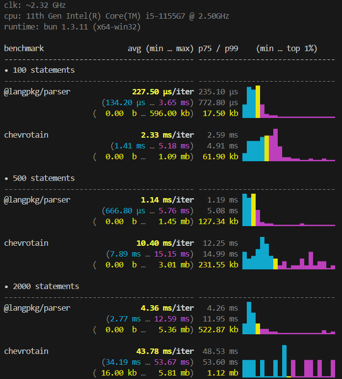

<!-- ╔══════════════════════════════ BEG ══════════════════════════════╗ -->

<br>
<div align="center">
    <p>
        
    </p>
</div>

<div align="center">
    <p align="center" style="font-style:italic; color:gray;">
        Fast, general-purpose parser for building language tooling.<br>
        <b>Up to ~10x faster than chevrotain</b>.
        <br>
    </p>
    
    <a href="https://github.com/langpkg"></a>
    <br>
    
    
    <br>
    
    
    
</div>
<br>

<!-- ╚═════════════════════════════════════════════════════════════════╝ -->


<!-- ╔══════════════════════════════ DOC ══════════════════════════════╗ -->

- ## Benchmark

    

    > _**To run the benchmark, use: `bun run bench`**_

    > _**To check the benchmark code, read: [`./bench/index.bench.ts`](./bench/index.bench.ts).**_

    <br>
    <br>


- ## Core Features 🎯

    - ### Pattern Builders (Easy API)

        ```typescript
        import {
            token, seq, choice, optional, repeat,
            oneOrMore, zeroOrMore, rule, pratt,
            delimited, surrounded, between,
        } from '@langpkg/parser';

        // Expressions
        const expr = seq(token('NUM'), token('PLUS'), token('NUM'));

        // Operators
        const stmt = choice(
            rule('letStmt'),
            rule('ifStmt'),
            rule('exprStmt'),
        );

        // Repetition
        const params = delimited(token('IDENT'), token('COMMA'));

        // Optional
        const semicolon = optional(token('SEMI'));
        ```

    - ### Rule Parameters (Flexible Control Flow)

        ```typescript
        // Pass context to rules
        const expr = rule('expr', { precedence: 10, associative: 'left' });

        // Rules receive params in parser state
        createRule('expr', pattern, {
            build: (result, parser) => {
                // Access parser state
                console.log(parser.isNextToken('PLUS'));
            }
        });
        ```

    - ### String Shorthand (Readable Patterns)

        ```typescript
        // Register shortcuts
        registerTokenMap({
            'let'   : 'LET',
            'if'    : 'IF',
            '='     : 'EQ',
            '{'     : 'LBRACE',
        });

        // Now use directly in patterns
        seq('let', token('IDENT'), '=', rule('expr'));
        ```

    - ### Error Recovery (Production-Grade)

        ```typescript
        // Strict mode: stop on first error
        { errorRecovery: { mode: 'strict', maxErrors: 1 } }

        // Resilient mode: collect all errors
        { errorRecovery: { mode: 'resilient', maxErrors: 100 } }

        // Sync recovery: skip tokens until recovery point
        errorRecoveryStrategies.synchronize(['SEMI', 'RBRACE'])
        ```

    - ### Conditional Parsing (Context-Aware)

        ```typescript
        // Parse based on parser state
        conditional(pattern, (context) => {
            // context has:
            // - parser: full Parser instance
            // - result: from inner pattern
            // - index: current position
            // - depth: rule nesting level
            // - ruleStack: call stack
            return context.depth < maxDepth;
        })
        ```

    - ### Pratt Expressions (Operator Precedence)

        ```typescript
        const exprTable = buildPrattTable({
            prefix: {
                'MINUS': { bp: 70, parse: (parser, tok) => {...} },
                'LPAREN': { bp: 0, parse: (parser, tok) => {...} },
            },
            infix: {
                'PLUS':  { lbp: 50, parse: (parser, left, tok) => {...} },
                'STAR':  { lbp: 60, parse: (parser, left, tok) => {...} },
                // Right-associative (rbp < lbp)
                'POWER': { lbp: 70, rbp: 69, parse: (parser, left, tok) => {...} },
            },
        });

        const expr = pratt(exprTable);
        ```

    - ### Advanced Patterns

        ```typescript
        // Lookahead without consuming
        lookahead(pattern)  // Also: peek()

        // Negative lookahead
        not(pattern)

        // Action for side effects
        action((parser) => {
            parser.stats.customCounter++;
        })

        // Helpers
        surrounded(content, open, close)        // (content)
        between(open, content, close)           // Same as surrounded
        delimited(item, sep, {min, trailingOk}) // Comma-separated lists
        ```

    - ### Rule Compilation

        ```typescript
        // Input rule
        createRule('expr', seq(token('NUM'), token('PLUS'), token('NUM')))

        // Compiles to:
        const exprRule = {
            pattern: {
                type: 'seq',
                patterns: [
                    { type: 'token', name: 'NUM', ... },
                    { type: 'token', name: 'PLUS', ... },
                    { type: 'token', name: 'NUM', ... },
                ]
            },
            // Closure compiled from pattern tree
            // Direct JS function calls (no interpreter)
        };
        ```

    - ### Lookahead Set Computation

        ```typescript
        // For each choice, compute FIRST(alternative)
        choice(
            seq(token('LET'), ...),   // FIRST = {LET}
            seq(token('FN'), ...),    // FIRST = {FN}
            seq(token('IDENT'), ...), // FIRST = {IDENT}
        )

        // Runtime: O(1) token → alternative mapping
        ```

    <br>
    <br>

- ## Quick Start 🔥

    - ### 1. Install

        ```bash
        bun add @langpkg/parser @langpkg/lexer
        # or
        npm install @langpkg/parser @langpkg/lexer
        ```

    - ### 2. Define Your Grammar

        ```typescript
        import { createRule, token, seq, choice, rule } from '@langpkg/parser';

        const rules = [
            createRule('expr', seq(
                token('NUM'),
                choice(
                    seq(token('PLUS'), rule('expr')),
                    seq(token('MULT'), rule('expr')),
                ),
            )),
        ];
        ```

    - ### 3. Tokenize & Parse

        ```typescript
        import { compile } from '@langpkg/lexer';

        const lexer = compile({ /* tokens */ });
        const tokens = lexer.tokenize(source);

        const { ast, errors } = parse(tokens, rules, {
            startRule: 'expr',
            errorRecovery: { mode: 'resilient' },
        });
        ```

    <br>
    <br>

- ## Documentation 📑

    - ### Why Fast?

        - #### 1. **Compile-Time LL(1) Optimization**
            ```typescript
            // Once at Parser construction
            _buildLookaheadSets()  // Computes first-sets for each rule
            ↓
            choice(a, b, c)        // O(1) branch selection (no backtracking)
            ```

        - #### 2. **Pre-Compiled Rule Closures**
            ```typescript
            // Each rule compiled to a JS function at parser init
            const ruleExpr = compiled(() => {
                // No interpreter switch in hot path
                // Direct method calls
            });
            ```

        - #### 3. **Integer-Keyed Memoization**
            ```typescript
            // Key = (ruleIndex << 16) | tokenIndex
            // Benefits:
            // ✅ No string concatenation per lookup (~3x faster)
            // ✅ O(1) access (Map.get with number key)
            // ✅ Supports 65k rules × 65k tokens
            ```

        - #### 4. **Pratt Expression Parsing**
            ```typescript
            // Dedicated precedence climbing for expressions
            // Not recursive descent (cheaper stack frames)
            // Proper operator associativity handling
            ```

        - #### 5. **Zero-Alloc Backtracking**
            ```typescript
            // On failed pattern, return shared FAIL sentinel
            // Restore token index on way out
            // No memory allocation on backtrack attempts
            ```

        <div align="center">  </div>
        <br>

    - ### API

      - #### Core Functions

        | Function                              | Purpose                              |
        | ------------------------------------- | ------------------------------------ |
        | `parse(tokens, rules, settings)`      | Main parser entry point              |
        | `createRule(name, pattern, options?)` | Define a grammar rule                |
        | `token(name, value?)`                 | Match a token by kind or value       |
        | `seq(...patterns)`                    | Sequence (all must match in order)   |
        | `choice(...patterns)`                 | Ordered choice (first to match wins) |
        | `optional(pattern)`                   | Zero or one occurrence               |
        | `repeat(pattern, min?, max?, sep?)`   | Repetition with bounds               |
        | `oneOrMore(pattern, sep?)`            | 1+ occurrences                       |
        | `zeroOrMore(pattern, sep?)`           | 0+ occurrences                       |
        | `zeroOrOne(pattern)`                  | Alias for optional                   |
        | `rule(name, params?)`                 | Reference another rule               |
        | `pratt(table)`                        | Pratt expression parser              |
        | `buildPrattTable(config)`             | Build operator precedence table      |
        | `delimited(item, sep, options?)`      | Comma-separated lists                |
        | `surrounded(content, open, close)`    | Parenthesized content                |
        | `between(open, content, close)`       | Alias for surrounded                 |
        | `conditional(pattern, predicate)`     | Conditional matching                 |
        | `when(pattern, predicate)`            | Alias for conditional                |
        | `action(fn)`                          | Side effects during parsing          |
        | `not(pattern)`                        | Negative lookahead                   |
        | `lookahead(pattern)`                  | Positive lookahead                   |
        | `peek(pattern)`                       | Alias for lookahead                  |
        | `silent(pattern)`                     | Hide from AST                        |
        | `loud(pattern)`                       | Show in AST                          |
        | `registerTokenMap(map)`               | String shorthand for tokens          |

        <div align="center">  </div>
        <br>

      - #### Types


        ```typescript
        // Token with position info
        interface Token {
            kind: string;
            value: string | null;
            span: { start: number; end: number };
        }

        // Parse result
        interface ParseResult {
            ast: Result[];
            errors: ParseError[];
            statistics?: ParseStatistics;
        }

        // Pattern definition
        interface Pattern {
            type: 'token' | 'rule' | 'seq' | 'choice' | 'repeat' | ...;
            silent?: boolean;
            name?: string;
            params?: Record<string, unknown>;
            // ... (12+ pattern-specific fields)
        }

        // Rule definition
        interface Rule {
            name: string;
            pattern: Pattern;
            options?: {
                build?: (result: Result, parser: Parser) => Result;
                errors?: ErrorHandler[];
                recovery?: RecoveryStrategy;
            };
        }
        ```

    <br>
    <br>

- ## Credits ❤️

    > Inspired by [@je-es/parser](https://github.com/je-es/parser) and [Chevrotain](https://github.com/chevrotain/chevrotain).

    > Built as part of the Mine language compiler toolchain.

    <br>
    <br>

- ## Dev Notes 📝

    > I'm currently working on **+10 packages** simultaneously, so **sometimes** i use the AI to write some **parts of the documentation** -- if you spot something incorrect that I may have missed, please **open an issue** and let me know.
    >
    > And **if you'd like to fix something yourself**, feel free to **fork the repo** and **open a pull request** -- I'll review it and happily merge it if it looks good.
    >
    >Thank you!

<!-- ╚═════════════════════════════════════════════════════════════════╝ -->


<!-- ╔══════════════════════════════ END ══════════════════════════════╗ -->

<br>
<br>

---

<div align="center">
    <a href="https://github.com/maysara-elshewehy"></a>
</div>

<!-- ╚═════════════════════════════════════════════════════════════════╝ -->